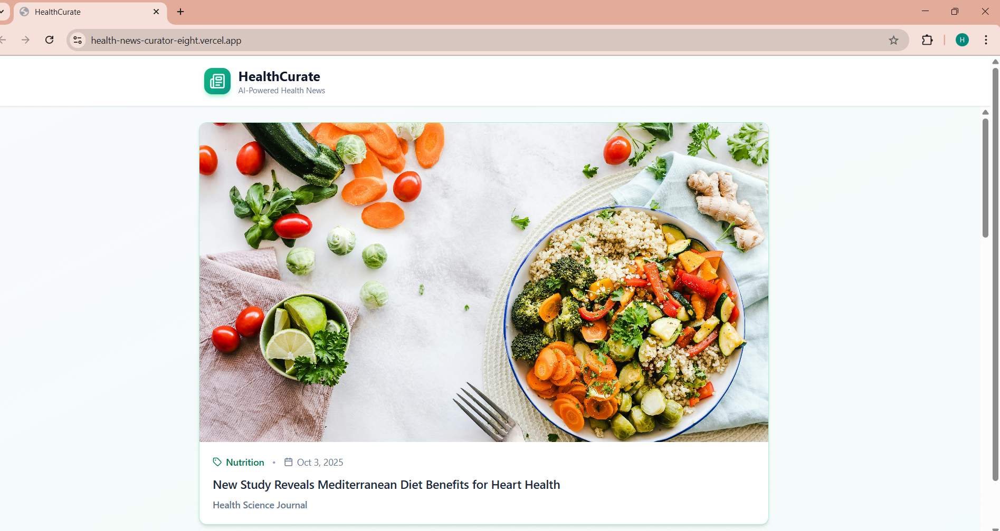
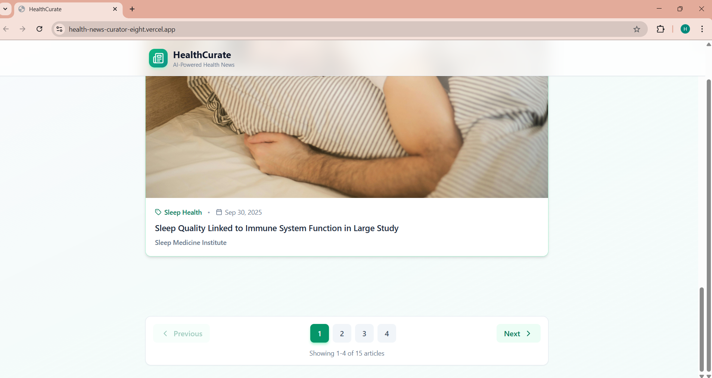
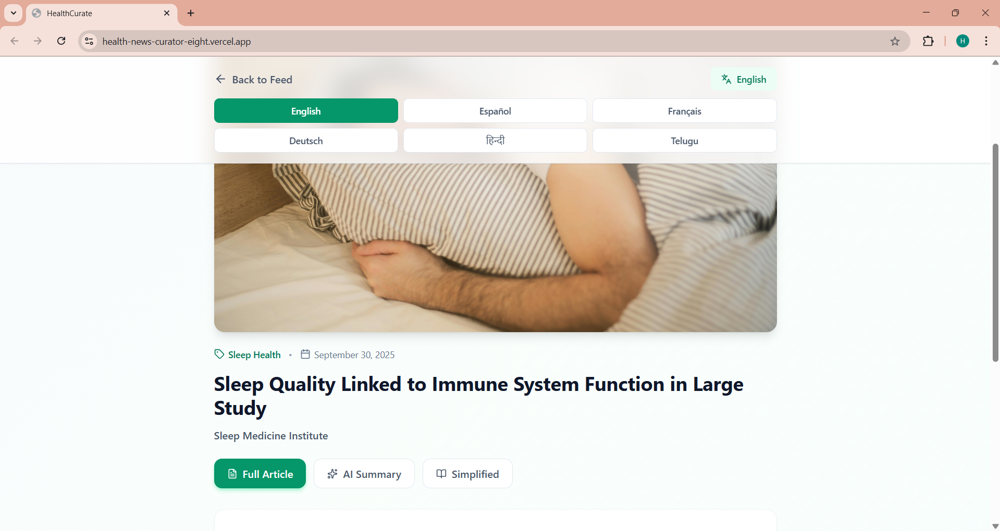
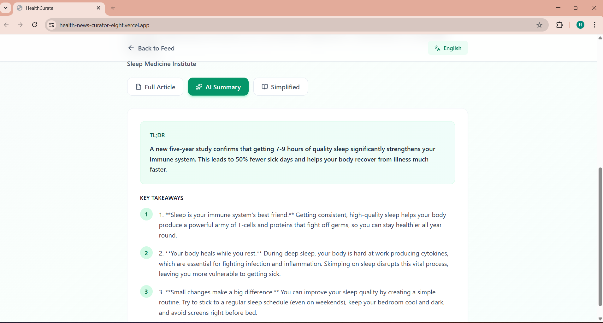

# Health News Curator(AI-Powered) 📰🤖

An AI-powered web application that summarizes, and simplifies health-related news articles.  
Built with **React (frontend)** and **Node.js/Express (backend)**, with integration of *Google Gemini AI*.

---

## 🔗 Important Links
 Hosted App:https://health-news-curator-eight.vercel.app/
 GitHub Repository:https://github.com/harshitasuryawanshi2003/Health-News-Curator

 ---

## 🌟 Features

• Gemini AI Integration (Summarization + Simplification)

• Multi-language support (English by default)

• Instant TL;DR and key takeaways

• Rewrites full article in simple tone

• Refreshes news feed from mock dataset

• Responsive frontend with article viewer

• Modular backend with clean route/service/controller structure

---

## 🏗️ Architecture & State Management

🧱 Stack

• Frontend: React + Vite

• Backend: Express.js

• AI Model: Gemini API (via Google Generative Language API)

• Language: JavaScript (ES6)

---

📊 Data Flow

```bash
React App → aiService.js → /api/ai/* → geminiService.js → Gemini API → Response
```

🧠 State Management

• useState for articles, selectedArticle, loading state

• No Redux or global store needed (scoped local state)

---

## 🚀 Prompts Used & Refinements

• Summary Prompt:
 
 ```bash
   const prompt = `
            You are an AI Health News Curator.

            Tasks:
            1. Summarize the article in 2 lines (TL;DR).
            2. Provide 3 key takeaways in simple, friendly language.

            Article:
            ${articleText}
            ${langInstruction}

            Format:
            ### TL;DR
            [2-line summary]

            ### Key Takeaways
            1. ...
            2. ...
            3. ...
            `;
```

• Simplification Prompt:
```bash
    const prompt = `
        You are an AI Health News Curator.
        Rewrite the following health article in a simple, friendly tone suitable for general readers:

        Article:
        ${articleText}
        ${langInstruction}
        `;
```

---

## 📷 Screenshots

• Home page
 
 

 

• Article View

 

• Detail View with TL;DR and key takeaways

  

• Simplified Article View

---

## 🐞 Known Issues

• No real-time news scraping or live APIs

• Gemini API rate limits may affect high-volume usage

• Some edge cases in language simplification

• Parsing errors if Gemini returns unexpected formats

• Basic error handling for API errors

---

## 🌱 Potential Improvements

• Real news API (e.g. NewsAPI.org, NYT Health Feed)

• User login system with personalization

• Store AI summaries in database for caching

• Feedback buttons (👍/👎 for AI output)

• Theme switcher (Dark/Light mode)

• Switch to TypeScript for better type safety

---

## 📦 Setup Instructions

1. Clone the repository:
    ```bash
    git clone https://github.com/harshitasuryawanshi2003/Health-News-Curator.git
    cd Health-News-Curator
    ```

2. Install dependencies:
    Frontend:
        ```bash
        npm install
        ```
    Backend:
        ```bash
        cd server
        npm install
        ```

3. Setup Environment:

   Create a .env file:
    ```bash
    GEMINI_API_KEY=your_gemini_api_key
    PORT=4000
    ```

 
3. Start the server:
    ```bash
    npm run dev
    ```